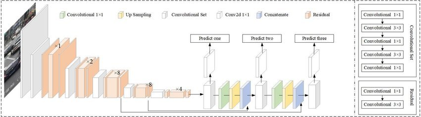

# Object Detection using OpenCV

**Table of Content**
1. Overview
2. Installation and running
3. Working

## Overview

OpenCV, short for Open Source Computer Vision Library, is an open-source computer vision and machine learning software library. It provides various tools and functions for tasks such as image and video processing, object detection, facial recognition, and more. It's widely used in academia and industry for a variety of applications, from robotics to augmented reality.
It is used in robotics for object detection, sementic segmentation, 
object labeling etc. 
OpenCv provides tools and models that are used to interface with the state of the art machine learning Computer Vision models across the industries.
Some of the popular models are :
1. [YOLO](https://pjreddie.com/media/files/tiny-yolov3.weights)You Look Only Once)
2. [MobileNetSSD](https://github.com/pjreddie/darknet/blob/master/cfg/tiny-yolov3.cfg)
3. [TinyYOLO](https://github.com/pjreddie/darknet/blob/master/cfg/tiny-yolov3.cfg)

## Installation and Running 

#### Setting up python virtual environment
Go to your workspace directory
```
python -m venv .
```

#### Adding sources
```
source bin/activate.bash
```
Choose appropriate source file according to your linux shell.

#### Installing Dependencies
Install required dependencies using the provided `requirements.txt` file 
```
pip install -r requirements.txt
```

#### Run the python file

```
python ObjectDetection.py
```


# Working 

Here's what the script does:

1. It initializes the video capture object using either the default camera (`cap = cv2.VideoCapture(0)`) or a video file path (`cap = cv2.VideoCapture("path/to/video.mp4")`). Video file used this is project is download from [here](https://github.com/intel-iot-devkit/sample-videos?tab=readme-ov-file).
3. It loads the pre-trained object detection model. We are using `yolov3` model, which and CNN object detection model.
4. It defines the target object to detect (e.g., "person").
5. It enters a loop to process each frame of the video:
    - It reads a frame from the video capture object.
    - It preprocesses the frame for object detection using the loaded model.
    - It iterates over the detected objects and checks if they match the target object with a confidence score above a threshold (0.5 in this case).
    - It applies non-maximum suppression to remove overlapping bounding boxes.
    - It draws bounding boxes around the detected objects and displays the object class and confidence score.
    - It displays the resulting frame with the bounding boxes.
6. Finally, it releases the video capture object and closes all windows.

###### YoloV3:

The YOLO machine learning algorithm uses features learned by a deep convolutional neural network to detect objects located in an image.  

YOLO is a Convolutional Neural Network (CNN), a type of deep neural network, for performing object detection in real time. CNNs are classifier-based systems that process input images as structured arrays of data and recognize patterns between them. YOLO has the advantage of being much faster than other networks and still maintains accuracy. It allows the object detection model to look at the whole image at test time. This means that the global context in the image informs the predictions. YOLO and other convolutional neural network algorithms “score” regions based on their similarities to predefined classes.  


------------------
**Have a good day , bye bye ** 
